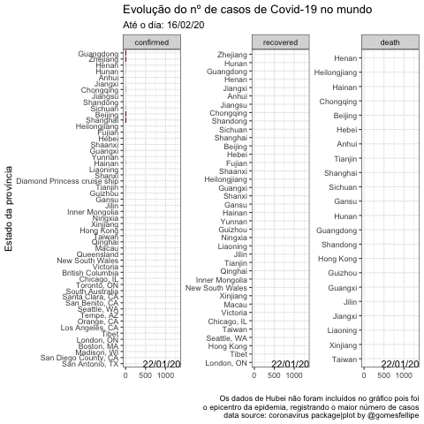

# Gráfico animado com dados do coronavirus

Este repositório contém o código utilizando para praticar a crição de gráficos animados com ggplot utilizando o dataset do pacote [coronavirus](https://github.com/RamiKrispin/coronavirus)

O código pode ser encontrado [aqui](./g_coronavirus.R)!

O gráfico gerado:

